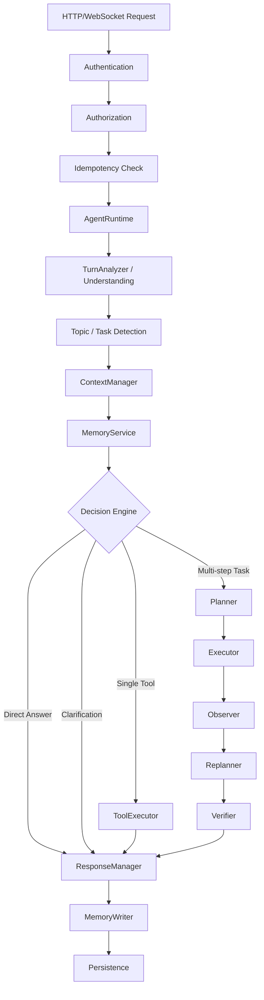

# LYSTRA AI — Canonical Architecture

## 1. Single Execution Path
The entire LYSTRA backend MUST adhere to this single, linear execution pipeline. There are no secondary loops, no competing agent classes, and no hidden orchestration bypasses.

## 2. Service Responsibilities

### 2.1 Core Orchestration
- **AgentRuntime (`backend/agent/runtime.py`)**: The absolute single source of truth for execution. It receives an authenticated, validated request, marshals the downstream services, and returns a unified response or stream. It replaces `ConversationEngine`, `AgenticEngine`, `Supervisor`, and `agent_loop`.

### 2.2 Security & Gateway
- **Authentication / Authorization**: Validates JWTs, sets the `current_user`, and ensures every downstream query explicitly filters by `user_id`. No service may look up a resource by `id` alone.
- **Idempotency**: Prevents double-execution of state-mutating requests by tracking `request_id`.

### 2.3 Intelligence & Context
- **TurnAnalyzer**: Extracts intent, sentiment, and structured parameters from the raw user utterance.
- **ContextManager (`backend/agent/context_manager.py`)**: Assembles the exact token-budgeted prompt for the LLM. It enforces the strict hierarchy: *Core Policy > Safety > Agent > Tools > User Profile > Memory > Task State > Request*.
- **MemoryService (`backend/memory/service.py`)**: Manages Vector (pgvector) and relational memory. Handles extraction, embedding, retrieval, and conflict resolution (via `supersedes_memory_id`).
- **Decision Engine**: Determines if the user request requires a simple conversational response, an immediate tool execution, or a complex ReAct multi-step plan.

### 2.4 ReAct Execution Engine
- **Planner (`backend/agent/planner.py`)**: Breaks complex requests into a JSON-serializable list of dependent tasks.
- **Executor (`backend/agent/executor.py`)**: Routes specific tasks to the `ToolExecutor`.
- **Observer (`backend/agent/observer.py`)**: Evaluates the environment and tool outputs after an execution step to determine if the state changed as expected.
- **Replanner (`backend/agent/replanner.py`)**: Modifies the remaining Plan if the Observer detects a failure or unexpected state.
- **Verifier (`backend/agent/verifier.py`)**: Performs a final LLM-based check to guarantee the overarching goal was met before responding to the user.

### 2.5 Tooling
- **ToolRegistry (`backend/tools/registry.py`)**: The single catalog of available tools, their schemas, and their risk levels.
- **ToolExecutor (`backend/tools/executor.py`)**: Enforces limits, schema validation, and permissions. Requires an explicit `user_id` to execute, guaranteeing tools cannot breach tenant isolation.

### 2.6 Persistence & State
- **ResponseManager**: Formats the final output into the canonical SSE protocol or REST schema.
- **MemoryWriter**: Asynchronously updates the user's Long-Term Memory and preferences based on the finalized turn.
- **Persistence**: PostgreSQL is the durable source of truth. Redis is used exclusively for ephemeral streaming coordination and rate-limiting. Celery executes detached tasks. Process memory (`{}`) is strictly forbidden.
